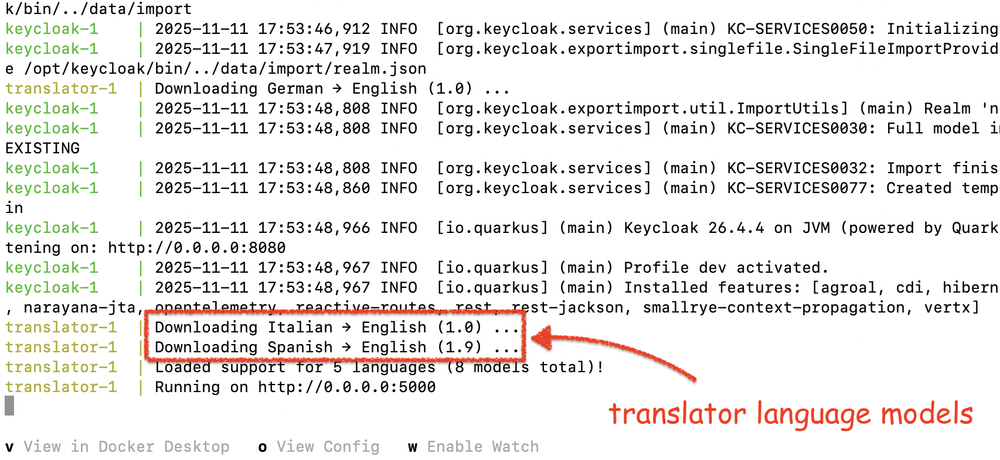
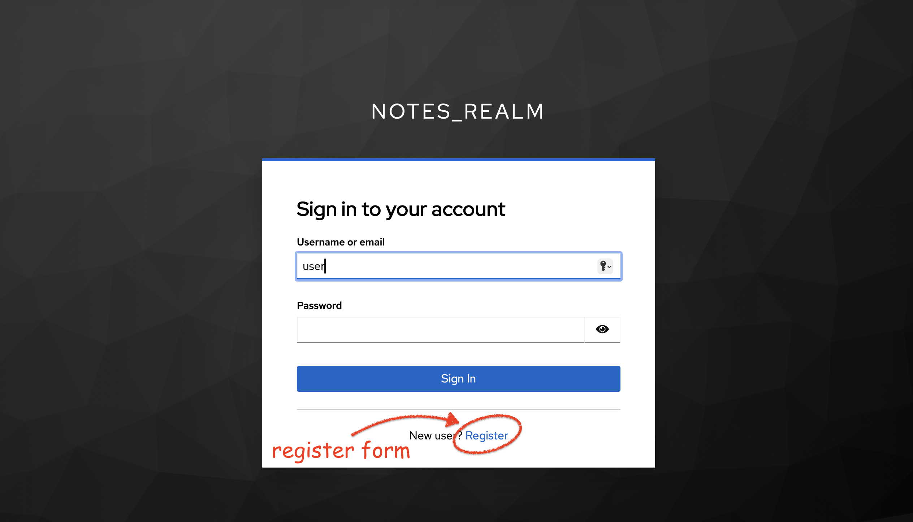
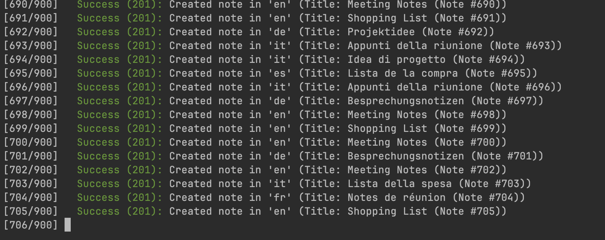
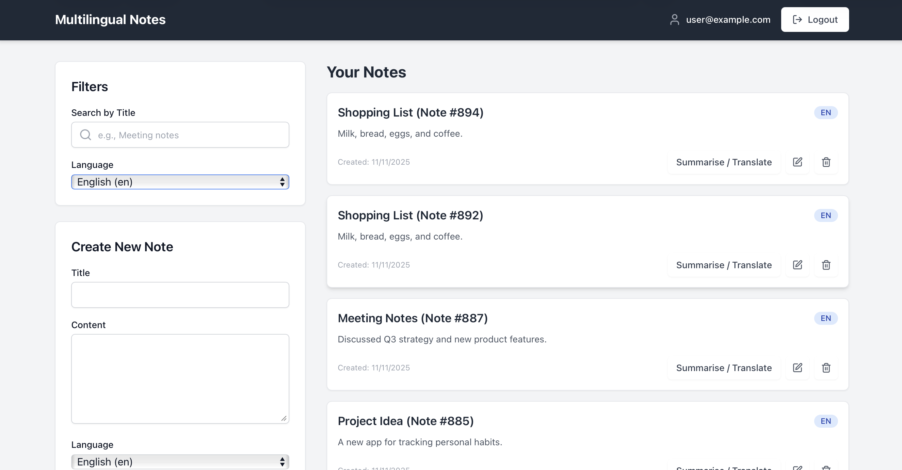

# Multilingual Notes

Multilingual Notes, Global Voices Ltd.

This project is a full-stack application featuring a React frontend, a NestJS backend, custom translator and a Keycloak
instance for authentication, all managed with Docker Compose.

## How to run the application

First, ensure you have the latest Docker and Docker Compose installed.

Create a `.env` file in the project root, using `.env.example` as a template, to provide the necessary secrets, e.g.

```bash
cp .env.example .env
```

Adjust `.env` config if necessary and spin up docker compose [template](docker-compose.yml) 

```bash
docker compose up --build
```

Give a minute for translator language models to complete downloading on first run:



The frontend will be available at http://localhost:8081, and backend at http://localhost:3000.



There is a pre-populated user with id `user` and password `Passw0rd!`. Demo script creates additionally another user
via REST APIs with id `demo` and same password `Passw0rd!`. You can create any number of users via _Register_ form, and
manage them in the Keycloak admin console under `notes_realm`.

Use Keycloak admin credentials set in `.env` config to access console at http://localhost:8080.

To start all services with a clean state (including a pre-configured Keycloak realm and a sample user), you must first
**clean any old data volumes** to ensure the Keycloak realm is imported correctly. Run `docker compose down -v` to remove
previously cached persistent data (if any).

```bash
docker compose down -v
```

And run `docker compose up --build` again.

## How to run the demo script

Once the Docker containers are running, you can use the [demo.sh](./scripts/demo.sh) script to probe the backend API.
This script bypasses the browser login and authenticates directly with Keycloak by creating a separate user. First,
make the script executable, and then run it

```bash
chmod +x scripts/demo.sh
./scripts/demo.sh
```

The script will obtain a JWT access token from Keycloak, create a new note, list all notes, request
a summary and translation, and then delete the note, printing its progress at each step.

## How to generate many notes

There is a [script](./scripts/notes.sh) that allows to generate some random notes for a `user`

```bash
chmod +x scripts/notes.sh
./scripts/notes.sh
```





## Assumptions

### A

Solution is deployed in UNIX environment. I have no way to test it on Windows: the docker template and network wiring.

### B

UI can be kept to a bare minimum without fancy styling and layout to demonstrate requested technologies used only.
Good UX requires series of discussions with key stakeholders and user feedback (if possible).

### C

TLS termination is typically performed at the Gateway server, and is not required in this demo setup.

### D

User credentials are not handled by custom solutions these days as these are prone to code mistakes that introduce 
vulnerabilities. In order to not re-invent the wheel, Keycloak is proposed as a relatively mature solution to manage
user credentials and secure sessions. Solutions such as Keycloak open the door to many other platform integrations.

**Note**, `POST /api/auth/register` and `POST /api/auth/login` are not implemented in this demo. See _cURL_ requests
for user registration and authentication flow in the [demo.sh](./scripts/demo.sh) script.

### E

Solution is produced for a handful of users, scale is of no concern at this stage.

### F

Unit- and end-to-end tests - samples only, to demonstrate understanding in test approaches. Demo script covers happy
paths for minimal backend end-to-end testing. Manual QA for UI.

## Analysis

See initial [analysis](docs/analysis.md) with design drafts and generated code.

## Development

Refer to [dev guide](./docs/dev.md) for detailed development instructions.

## To do

* Fix: add pagination for a large list of notes. Currently, view is limited to a fixed number of notes in the UI.
* Fix: all-languages search. Search works for a selected language only, not for all together.
* Summariser with a light LLM model (container).
* Unit- snd e2e test samples.
* Rate limiting.
* Audit logs.
* Loading states?..
* QA mobile web view.
